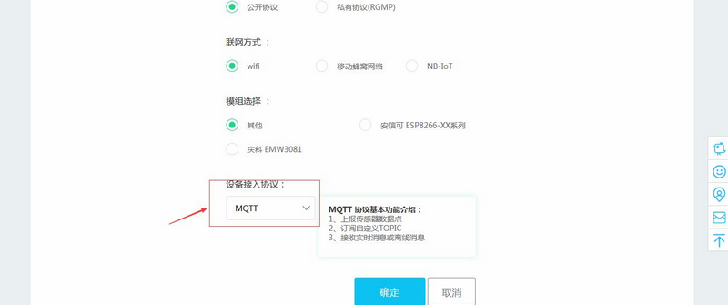
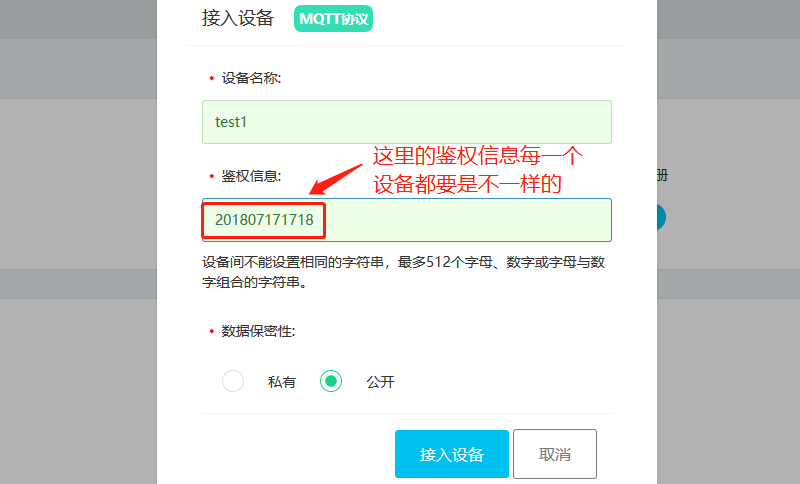
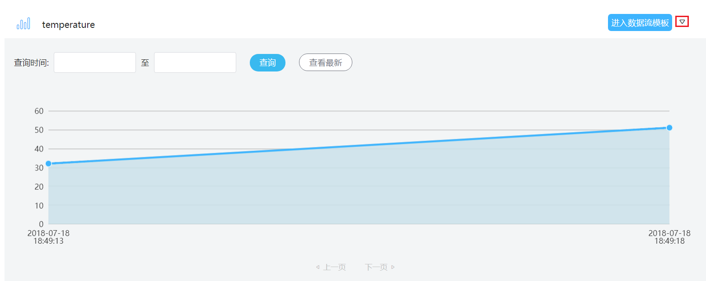
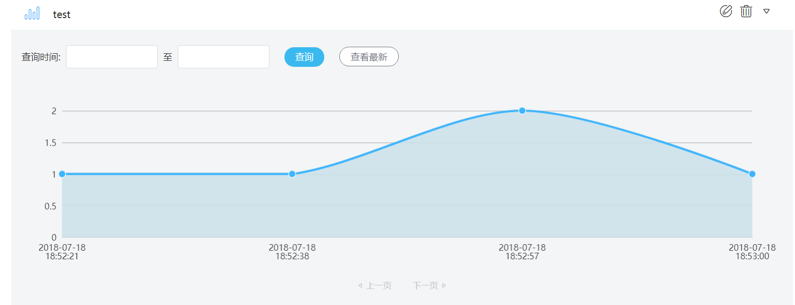
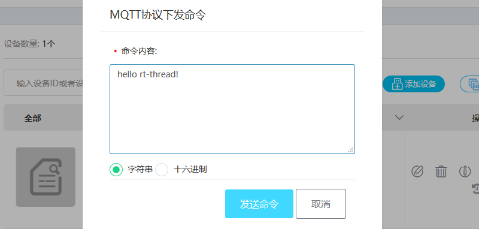

# OneNET 示例应用程序 #

## 准备工作

### 在 OneNET 云上注册账号

设备接入 OneNET 云之前，需要在平台注册用户账号，OneNET 云平台地址：<https://open.iot.10086.cn>

#### 创建产品

账号注册登录成功后，点击**开发者中心**进入开发者中心界面；

点击**创建产品**，输入产品基本参数，页面最下方设备接入协议选择 `MQTT` 协议，如下图所示：




产品创建成功之后，可以在开发者中心左侧**产品概况**中查看产品基础信息（如产品ID，接入协议，创建时间，产品 APIkey 等，后面有用）。

#### 接入设备

在开发者中心左侧**设备管理**中点击`添加设备`按钮添加设备，设备名称我们填入`test1`。鉴权信息是为了区分每一个不同的设备，如果创建了多个设备，要确保每个设备的鉴权信息都不一样，我们这里填入`201807171718`,填完之后点击接入设备





#### 添加 APIkey

接入设备之后，可以看到设备管理的界面多了一个设备，设备的右边有一些操作设备的按钮，点击查看详情按钮


此设备的相关信息就都显示出来了，比如：设备 ID、鉴权信息、设备 APIkey，这些信息需要记下，在ENV配置时会用到。

点击按钮添加 APIkey，APIKey 的名称一般和设备相关联，我们这里填入`test_APIKey`，关联设备写入我们刚刚创建的设备`test1`。 


#### 开启 onenet 软件包

打开 env 工具输入 menuconfig 按照下面的路径开启 onenet 软件包

```{.c}
RT-Thread online packages
    IoT - internet of things  --->
        [*] OneNET: China Mobile OneNet cloud SDK for RT-Thread
```

进入 onenet 软件包的配置菜单按下图所示配置，里面的信息依据自己的产品和设备的**实际情况**填写

```{.c}
--- OneNET: China Mobile OneNet cloud SDK for RT-Thread                            
    [ ]   Enable OneNET sample                                                  
    [*]   Enable support MQTT protocol                                                 
    [ ]   Enable OneNET automatic register device (NEW)                             
    (35936966) device id                                                             
    (201807171718) auth info
    (H3ak5Bbl0NxpW3QVVe33InnPxOg=) api key                                              
    (156418) product id                                                                 
    (dVZ=ZjVJvGjXIUDsbropzg1a8Dw=) master/product apikey (NEW)                       
        version (latest)  --->
```

**Enable OneNET sample** ：开启 OneNET 示例代码

**Enable support MQTT protocol** ：开启 MQTT 协议连接 OneNET 支持

**Enable OneNET automatic register device** ：开启  OneNET 自动注册设备功能

**device id** ：配置云端创建设备时获取的 `设备ID`

**auth info** ：配置云端创建产品时 `用户自定义的鉴权信息` (每个产品的每个设备唯一)

**api key** ：配置云端创建设备时获取的 `APIkey`

**product id** ：配置云端创建产品时获取的 `产品ID`

**master/product apikey** ：配置云端创建产品时获取的 `产品APIKey`

## 示例文件介绍 ##

利用 ENV 生成工程后，我们可以在工程的 onenet 目录下看到`onenet_sample.c`文件，该文件是 **OneNET** 软件包的示例展示，主要是展示用户如何使用 **OneNET** 软件包上传数据和接收命令。

## 运行示例

在使用 OneNET 软件包之前必须要先调用`onenet_mqtt_init`这个命令进行初始化，初始化完成后设备会自动连接 OneNET 平台。

```{.c}
msh />onenet_mqtt_init
[D/ONENET] (mqtt_connect_callback:85) Enter mqtt_connect_callback!
[D/[MQTT] ] ipv4 address port: 6002
[D/[MQTT] ] HOST = '183.230.40.39'
[I/ONENET] RT-Thread OneNET package(V0.2.0) initialize success.
msh />[I/[MQTT] ] MQTT server connect success
[D/ONENET] (mqtt_online_callback:90) Enter mqtt_online_callback!
```

### 上传数据

初始化完成后，用户可以调用`onenet_upload_cycle`这个命令周期性的往云平台上传数据。输入这个命令后，设备会每隔 5s 向数据流 temperature 上传一个随机值。并将上传的数据打印到 shell 窗口。

```{.c}
msh />onenet_upload_cycle
msh />[D/ONENET] (onenet_upload_data:106) buffer : {"temperature":32}
[D/ONENET] (onenet_upload_data:106) buffer : {"temperature":51}
```

我们打开 OneNET 平台，在设备管理的界面点击数据流管理按钮进入数据流界面。


点击`temperature`数据流右边的小箭头显示数据流信息，我们就可以看到刚刚上传的数据了。



如果用户想往别的数据流发送信息，可以使用以下 API 往云平台上传数据。

> onenet_mqtt_publish_digit
> onenet_mqtt_publish_string

命令格式如下所示

```{.c}
onenet_mqtt_publish_digit 数据流名称 要上传的数据

onenet_mqtt_publish_string 数据流名称 要上传的字符串
```

输入命令后没有返回错误信息就表示上传成功。

示例如下

```{.c}
msh />onenet_mqtt_publish_digit test 1
msh />onenet_mqtt_publish_string test 1
msh />onenet_mqtt_publish_digit test 2
msh />onenet_mqtt_publish_string test 1
```

在数据流管理页面，我们可以看到多出来个 test 数据流，里面的数据就是我们刚刚上传的数据。



### 接收命令

在初始化时，命令响应回调函数默认指向了空，想要接收命令，必须设置命令响应回调函数，在 shell 中输入命令`onenet_set_cmd_rsp`,就把示例文件里的命令响应回调函数挂载上了，这个响应函数在接收到命令后会把命令打印出来。

```{.c}
msh />onenet_set_cmd_rsp
```

我们点击设备管理界面的发送命令按钮。


在弹出来的窗口里输出 hello rt-thread！，然后点击发送命令。



就可以在 shell 中看到云平台下发的命令了。

```{.c}
msh />onenet_set_cmd_rsp
msh />[D/ONENET] (mqtt_callback:60) topic $creq/6db0c1b2-9a7e-5e4a-8897-bf62d4a3461f receive a message
[D/ONENET] (mqtt_callback:62) message length is 18
[D/ONENET] (onenet_cmd_rsp_cb:107) recv data is hello rt-thread！
```

